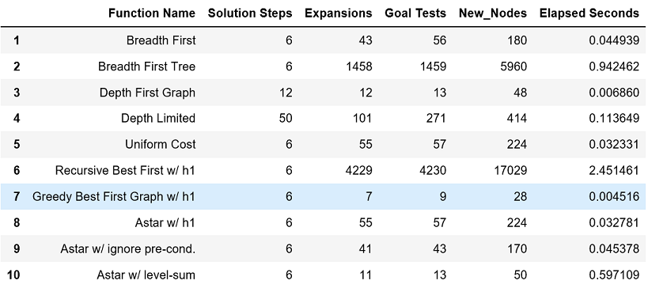
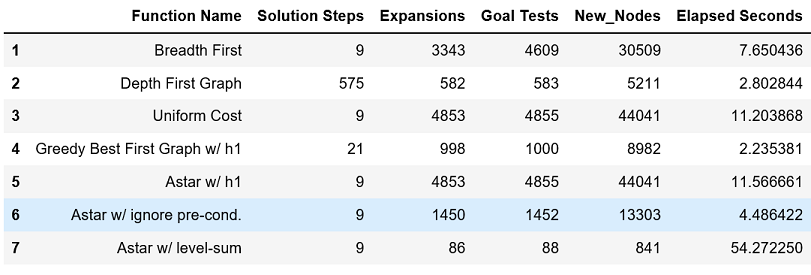
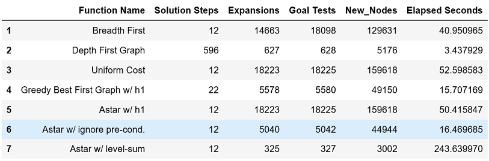

# Project Goal
In this repo I want to discuss my implementation for solving deterministic logistics planning problems for an Air Cargo transport system using a planning search agent.  Completion of this assignment is part of Udacity’s program [Artificial Intelligence Nanodegree (AIND) and Specializations.](https://confirm.udacity.com/GGGH2GSK)

# Air Cargo Planning Project Instructions 
To complete the [Air Cargo planning project](https://github.com/udacity/AIND-Planning) we need to solve three problems that are defined in classical PDDL (Planning Domain Definition Language).  Each problem has an initial state and a stated goal. To arrive at a solution we need to set up each problem for search, experiment with various automatically generated heuristics, including planning graph heuristics.  We also need to provide a discussion and analysis of our results, which is presented below.  Additionally, we need to write a short [research paper](research_paper.md) on three historical development of planning techniques and their use in artificial intelligence.


#### GIVEN: classical PDDL problems

All problems are in the Air Cargo domain.  They have the same action schema defined, but different initial states and goals.

### Air Cargo Action Schema:
```
Action(Load(c, p, a),
	PRECOND: At(c, a) ∧ At(p, a) ∧ Cargo(c) ∧ Plane(p) ∧ Airport(a)
	EFFECT: ¬ At(c, a) ∧ In(c, p))
Action(Unload(c, p, a),
	PRECOND: In(c, p) ∧ At(p, a) ∧ Cargo(c) ∧ Plane(p) ∧ Airport(a)
	EFFECT: At(c, a) ∧ ¬ In(c, p))
Action(Fly(p, from, to),
	PRECOND: At(p, from) ∧ Plane(p) ∧ Airport(from) ∧ Airport(to)
	EFFECT: ¬ At(p, from) ∧ At(p, to))
```

# Problem 1 Analysis
### Problem 1 initial state and goal:
```
Init(At(C1, SFO) ∧ At(C2, JFK) 
	∧ At(P1, SFO) ∧ At(P2, JFK) 
	∧ Cargo(C1) ∧ Cargo(C2) 
	∧ Plane(P1) ∧ Plane(P2)
	∧ Airport(JFK) ∧ Airport(SFO))
Goal(At(C1, JFK) ∧ At(C2, SFO))
```
I was able to find a path to solve problem 1 with the search functions listed in Table 1 shown below.  All the search functions in Table 1 found a path solution including 8 that found the solution in 6 actions.  The Greedy Best First Graph with h1 heuristic search function was the fastest and expanded the fewest nodes and produced the following solution path:
```
1.	Load(C1, P1, SFO)
2.	Load(C2, P2, JFK)
3.	Fly(P1, SFO, JFK)
4.	Fly(P2, JFK, SFO)
5.	Unload(C1, P1, JFK)
6.	Unload(C2, P2, SFO)
```
### Table 1


# Problem 2 Analysis

### Problem 2 initial state and goal:
```
Init(At(C1, SFO) ∧ At(C2, JFK) ∧ At(C3, ATL) 
	∧ At(P1, SFO) ∧ At(P2, JFK) ∧ At(P3, ATL) 
	∧ Cargo(C1) ∧ Cargo(C2) ∧ Cargo(C3)
	∧ Plane(P1) ∧ Plane(P2) ∧ Plane(P3)
	∧ Airport(JFK) ∧ Airport(SFO) ∧ Airport(ATL))
Goal(At(C1, JFK) ∧ At(C2, SFO) ∧ At(C3, SFO))
```
I was able to find a path to solve problem 2 with the 7 search functions listed in Table 2 below.  I did try to find a solution with the Breadth First Tree, Depth Limited and Recursive Best First with h1 heuristic search functions but I aborted the attempt after each search function exceeded 10 minutes without finding a path solution. The best performing search functions found a path solution in 9 actions.  The Astar with ignore pre-conditions heuristics function was the best performer, considering node expansions and time, with 1,450 expansions and found a path in 4.49 seconds.  The Astar with ignore pre-conditions heuristic function produced the following solution path:
```
1.	Load(C3, P3, ATL)
2.	Fly(P3, ATL, SFO)
3.	Unload(C3, P3, SFO)
4.	Load(C2, P2, JFK)
5.	Fly(P2, JFK, SFO)
6.	Unload(C2, P2, SFO)
7.	Load(C1, P1, SFO)
8.	Fly(P1, SFO, JFK)
9.	Unload(C1, P1, JFK)
```

### Table 2


# Problem 3 Analysis

### Problem 3 initial state and goal:
```
Init(At(C1, SFO) ∧ At(C2, JFK) ∧ At(C3, ATL) ∧ At(C4, ORD) 
	∧ At(P1, SFO) ∧ At(P2, JFK) 
	∧ Cargo(C1) ∧ Cargo(C2) ∧ Cargo(C3) ∧ Cargo(C4)
	∧ Plane(P1) ∧ Plane(P2)
	∧ Airport(JFK) ∧ Airport(SFO) ∧ Airport(ATL) ∧ Airport(ORD))
Goal(At(C1, JFK) ∧ At(C3, JFK) ∧ At(C2, SFO) ∧ At(C4, SFO))
```
I was able to find a path to solve problem 3 with the 7 search functions listed in Table 3 shown below.  I did try to find a solution with the Breadth First Tree, Depth Limited and Recursive Best First with h1 heuristic search functions but I aborted the attempt after each search function exceeded 10 minutes without finding a path solution. The best performing search functions found a path solution in 12 actions.  The Astar with ignore pre-conditions heuristic function was the best performer, considering node expansions and time, with 5,040 expansions and found a path in 16.47 seconds.  The Astar with ignore pre-conditions heuristic function produced the following solution path:
```
1.	Load(C2, P2, JFK)
2.	Fly(P2, JFK, ORD)
3.	Load(C4, P2, ORD)
4.	Fly(P2, ORD, SFO)
5.	Unload(C4, P2, SFO)
6.	Load(C1, P1, SFO)
7.	Fly(P1, SFO, ATL)
8.	Load(C3, P1, ATL)
9.	Fly(P1, ATL, JFK)
10.	Unload(C3, P1, JFK)
11.	Unload(C2, P2, SFO)
12.	Unload(C1, P1, JFK)
```

### Table 3


# Conclusion
In conclusion the uninformed search functions performed well in problem 1 but underperformed when the state space increased in problem 2 and 3.    Even when the uninformed  search functions found a solution to problem 2 and 3, it was either longer or had more node expansion.  Two main reasons why the uninformed search functions did not perform as well as the informed search functions are:
1.	Redundant paths: As explained in section 3.3 in AIMA(3rd Edition) algorithms that "forget their history are doomed to repeat it" because they consider redundant paths. To avoid exploring redundant paths an algorithm needs to keep track of explored states.  
   > * In our project the Breadth First Tree, and depth limited do not keep track of explored states and this explains why in problem 1 they found a path but could not do so in problem 2 and 3 within ten minutes.
   > * Search functions such as Breadth First, Astar and Depth First Graph utilize an explored set and thus performed better.
2.	The informed search functions utilize an evaluation function to select which node to expand next and can find solutions more efficiently than can an uninformed strategy (section 3.5 in AIMA 3rd Edition). This explains why the Astar with level sum evaluation and with Astar with ignore pre-conditions finds a solution with fewer node expansions than Breadth First.  